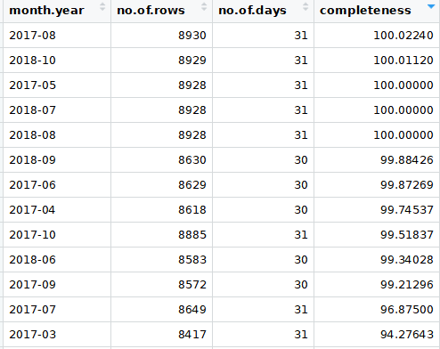

This notebook shows how River Water Level Data from Edmonton Canada can be filtered.
Google Style Guide for R https://google.github.io/styleguide/Rguide.xml
(UpperCamelCase for functions, period.separated for variable names) is adopted for this document.


Dataset Source: https://data.edmonton.ca/dataset/Water-Levels-and-Flows/cnsu-iagr

Note: the original dataset has chunks of missing data, rows with water level = -1. The data should be reported back on a 5 minute interval.

## Set Global variables for this program
Note: Edmonton "05DF001" `Edmonton` not used as it has two records with identical time stamp.
```{r Variable settings}
input.datafile <- "data/Water_Levels_and_Flows.csv"
station.name <- "atimCreek"
station.id <- "05EA012"
data.directory <- "/data/" 
```

## Data Import
Read the large `water.dataset` into R Environment. Note: The loading will take a minute or two as the file is 500MB in size.
```{r}
water.dataset<- read.csv(input.datafile)
```
Use the command below to check the loaded data.
```{r}
View(water.dataset)
```
## Data Tidying
This step is not needed as the dataset is already tidy (each column is a variable), each row is an observation.
</br>
</br>

## Data Transformation(DT)
### DT Part 1 - Narrow and Filter
Narrow, filter and store the selected River Water Level Station data(e.g. AtimCreek) into a dataset `station.data`
```{r}
station.data <- filter(water.dataset, Station.Number == station.id)
```

Optional 1: Next we can choose to store the dataset in the CSV format using the `write.csv` function. The CSV format allows the dataset to be used for Python programs. Here are the commands for saving the if we want to store this dataset to disk, key in the following command:

We run the `rm` command to remove the large `water.dataset` from memory.
```{r}
working.directory <- getwd()
write.csv(station.data, file=paste(working.directory,data.directory,station.name,".csv", sep=""))
rm(water.dataset)
```
</br>
Optional 2: If we would like to load the dataset from a previous run, run the following lines:
```{r echo=TRUE}
station.data <- read.csv(file=paste(working.directory,data.directory,station.name,".csv", sep=""))
head(station.data)
```

### DT - Part 2 - Select only data needed
The commands below select only the Date and Time and Water level columns out of the `station.waterlevel` dataset. 
```{r}
station.waterlevel<- select(station.data, Date.and.Time, Water.Level..m.)
head(station.waterlevel)
```
</br>

### DT - Part 3 - Sorting
Next we need to sort the rows according to date and time to get the rows in order for us to convert `station.waterlevel` into a time series. Use the `POSIXct` function to do so as our column has both date and time. `station.sortedwaterlevel` is the new dataset that has been sorted according to time.
```{r}
station.sortedwaterlevel <- station.waterlevel[order(as.POSIXct(station.waterlevel$Date.and.Time, format="%m/%d/%Y %H:%M:%S")),]
write.csv(station.sortedwaterlevel,file=paste(working.directory,data.directory,station.name,"_sorted_water_level.csv", sep=""))
head(station.sortedwaterlevel)
```
</br>

### DT - Part 4 - Cleaning 
In this portion, I will first see where there is incomplete data. To this I will use the `group_by()` to group the data into months and calculate the completeness statistic of the data.

#### updated on 31 Jan 2019
We will use the following code to detect if there is missing data in a particular month. We will group the water level info by month and summarise the number of records in each month and compare it against the number of supposed records per month.

We need to format the `station.sortedwaterlevel$Date.and.Time` which is of factor class into POSIXct class first.
```{r}
station.WLPOSIXct <- station.sortedwaterlevel
station.WLPOSIXct$Date.and.Time <- as.POSIXct(station.sortedwaterlevel$Date.and.Time, format="%m/%d/%Y %H:%M:%S")
head(station.WLPOSIXct)
```
Then we created a separate column using the substring `subtr()` function. The arguments `1,7` tells the function to only take the characters from 1 to 7 in the `Date.and.Time` column.

```{r}
station.WLPOSIXct$month.year <- substr(station.WLPOSIXct$Date.and.Time, 1,7)
head(station.WLPOSIXct)
```

Next we use the `groupy_by` and `summarise` with `mean, n()` functions to count the number of rows per month. 
For 31 days, if the data is complete, n = 60/5*24*31=8928 <br>
For 30 days, n = 8640 <br>
For 29 days, n = 8352 <br>
For 28 days, n = 8054 <br>
We store the results into a dataframe called `station.bymonth`. We also concatenate "-01" to the month.year column so we can calculate the no. of days in the month

```{r}
station.WLPOSIXct$no.of.days<-days_in_month(as.Date(station.WLPOSIXct$Date, format ="%Y-%m-%d"))
station.bymonth <- station.WLPOSIXct %>%
  group_by(month.year) %>%
  summarise(mean = mean(station.WLPOSIXct$Water.Level..m.), n = n())
station.bymonth$mean <- NULL
names(station.bymonth) <- c("month.year", "no.of.rows")
station.bymonth$no.of.days <- days_in_month(as.Date(paste(station.month$month.year,"-01",sep=""),format="%Y-%m-%d"))
station.bymonth$completeness <- station.bymonth$no.of.rows/(station.month$no.of.days*288)*100
head(station.bymonth)
```
31 Jan 19: From the table only May 2017, July and August 2018 has complete data. August 2018 and Oct 2018 had more than 100% data?. Some other months below show data that is above 90% completeness.
<br>



####11 Jan 2019

Spent one two hours trying to figure out why subset was not working correctly. Just found out huge missing chunks of data for Nov 2016! Data from 2016-11-01 00:00:00 to 2016-11-01 01:00:00 missing

We can use the `subset()` function to separate the data into months. We need to convert the `Date.and.Time` column from a factor class to a POSIXct class object before we can use the subset function with "YYYY-MM-DD HH:MM:SS" argument.
```{r}
station.WLPOSIXct <- station.sortedwaterlevel
station.WLPOSIXct$Date.and.Time <- as.POSIXct(station.sortedwaterlevel$Date.and.Time, format="%m/%d/%Y %H:%M:%S")
station.Nov2016 <- subset(station.WLPOSIXct, Date.and.Time > "2016-11-01 00:00:00" & Date.and.Time < "2016-12-01 00:00:00")

```


After plotting the sorted Water Level data, I noticed that there are some "-1" or invalid values. 
```{r}
station.series <- select(station.sortedwaterlevel, Water.Level..m.)
```

For the conversion from the vector into a time series object we use the `ts()` function. The `ts()` function requires that the frequency and start time to be specified in year format. The start date is found at the first row of the `station.sortedwaterlevel` dataset. We will take that value and use that as a `begin.datetime` value. Note: the start year was previously manually calculated as _2016.7883652_
```{r}
begin.datetime <- as.POSIXct(station.sortedwaterlevel[1,1],format="%m/%d/%Y %H:%M:%S",tz="mst")
station.timeseries <-ts(station.series, frequency = 12*24*365, start=c(as.yearmon(begin.datetime)))
plot.ts(station.timeseries)
title(main=paste(station.name,"River Water Level as is",sep=" "))
```

On Friday 28 Dec 2018, I tried to use ggplot to plot the time series. Results were not so good...Somehow `ggplot` cause a straight line to be drawn..
```{r}
#ggplot(data=station.sortedwaterlevel, aes(x = as.Date(station.sortedwaterlevel$Date.and.Time, format="%m/%d/%Y"), y = Water.Level..m.)) + geom_line() + scale_x_date(date_labels = "%b-%d-%Y") + xlab("") + ylab("Water Level")
#ggplot(data=station.sortedwaterlevel, aes(x = as.POSIXct(station.waterlevel$Date.and.Time, format="%m/%d/%Y %H:%M:%S"), y = Water.Level..m.)) + geom_line() + scale_x_datetime() + xlab("Time") + ylab("Water Level")
```

These values needs to be cleaned up and these samples removed. After cleaning, 98 samples with -1.000 water level was removed. Note: the removed samples has cause truncation in the dataset.
```{r}
station.cleanwaterlevel <- filter(station.sortedwaterlevel, Water.Level..m. > 0 )
```
Next we can convert the cleaned station water level data into a time series for time series analysis in R. We will need select only the datetime sorted `Water.Level..m.` column
```{r fig.cap="\\label{fig:figs} station.name"}
station.series <- select(station.cleanwaterlevel, Water.Level..m.)
station.timeseries <-ts(station.series, frequency = 12*24*365, start=c(as.yearmon(begin.datetime)))
plot.ts(station.timeseries)
title(main=paste(station.name,"River Water Level after removing -1s",sep=" "))
```

Next we are going to select just one month of data and try to predict 5 days of water level using the one month of data. We will choose a month where there are no missing values. We will use the `station.sortedwaterlevel` dataset to see which dates have missing values. 
```{r}
station.negativewaterLevel <- filter(station.sortedwaterlevel, Water.Level..m. < 0 )
View(station.negativewaterLevel)
```
From the `station.negativewaterLevel` dataset, it seems that Nov 2016, Dec 2016, Jan 2017, May 2017, Dec 2017, Jan 2018, July 2018, August 2018 are the dates without -1 water level values.


Next we compare the column n in `summary` with the no. of days

```{r}
station.WL_POSIXct$No.of.Days<-days_in_month(as.Date(station.WL_POSIXct$Date, format ="%Y-%m-%d"))
head(station.WL_POSIXct)
```
