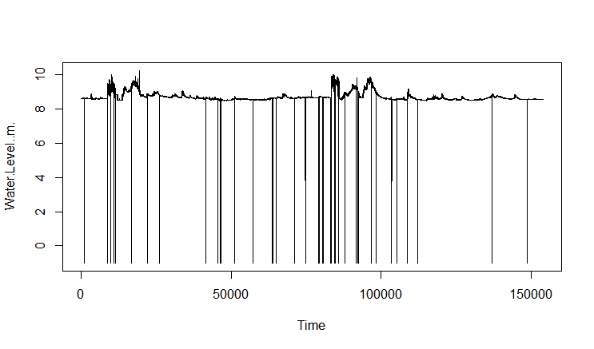

This notebook shows how River Water Level Data from Edmonton Canada can be filtered.
Google Style Guide for R is adopted for this document.

Dataset Source: https://data.edmonton.ca/dataset/Water-Levels-and-Flows/cnsu-iagr

## Set Global variables for this program
Note: Edmonton "05DF001" Edmonton not used as it has two records with identical time stamp.
```{r Variable settings}
input.datafile <- "data/Water_Levels_and_Flows.csv"
station.name <- "atimCreek"
station.id <- "05EA012"
data.directory <- "/data/" 
#setwd(working.directory)
```

## Data Import
Read the large dataset into R Environment. Note: The loading will take a minute or two as the file is 500MB in size.
```{r}
water.dataset<- read.csv(input.datafile)
```
Use the command below to check the loaded data.
```{r}
View(water.dataset)
```
## Data Tidying
This step is not needed as the dataset is already tidy (each column is a variable), each row is an observation.
</br>
## Data Transformation(DT)
### DT Part 1 - Narrow and Filter
Narrow, filter and store the selected River Water Level Station data(e.g. AtimCreek) into a dataset stationData. 
```{r}
station.data <- filter(water.dataset, Station.Number == station.id)
```

Optional: Next we can choose to store the dataset in the CSV format using the write.csv function. The CSV format allows the dataset to be used for Python programs. Here are the commands for saving the if we want to store this dataset to disk, key in the 
following command:

We run the rm command to remove the large dataset from memory.
```{r}
working.directory <- getwd()
write.csv(station.data, file=paste(working.directory,data.directory,station.name,".csv", sep="")) 
rm(water.dataset)
```

### DT - Part 2 - Select only data needed
The commands below select only the Date and Time and Water level columns out of the AtimCreek River dataset. 
```{r}
station.waterlevel<- select(station.data, Date.and.Time, Water.Level..m.)
```

### DT - Part 3 - Sorting
Next we need to sort the rows according to date and time to get the rows in order for us to convert station.waterlevel into a time series. Use the POSIXct function to do so as our column has both date and time. station.sortedwaterlevel is the new dataset that has been sorted according to time.
```{r}
station.sortedwaterlevel <- station.waterlevel[order(as.POSIXct(station.waterlevel$Date.and.Time, format="%m/%d/%Y %H:%M:%S")),]
write.csv(station.sortedwaterlevel,file=paste(working.directory,data.directory,station.name,"_sorted_water_level.csv", sep=""))

```

### DT - Part 4 - Cleaning?
After plotting the atimCreek Water Level, I noticed that there are some "zero" or invalid values. Note:
```{r}
#need some code to plot station.sortedwaterlevel before cleaning.
```
||
|:--:|
| *station.name Water Level before sorting and cleaning*|

These values needs to be cleaned up and these samples removed. After cleaning, 98 samples with -1.000 water level was removed.
```{r}
station.cleanwaterlevel <- filter(station.sortedwaterlevel, Water.Level..m. > 0 )
```
Next we can convert the cleaned station water level data into a time series for time series analysis in R. We will need select only the datetime sorted Water.Level..m. column
```{r}
atimCreek_Series <- select(atimCreek_WL_Clean, Water.Level..m.)
write.csv(atimCreek_Series, "C:/Users/andre/Desktop/WaterLevel/atimCreek_Series.csv")
```
For the conversion from the vector into a time series object we use the ts() function. The ts() function requires that the frequency and start year is specified. The start date is found at the first row of the atimCreek_WL_Sort.csv file. We will take that value and use that as a begintime value. 
```{r}
begintime <- 
```

```{r}
atimCreek_ts <-ts(atimCreek_Series, frequency = 12*24*365, start=c(2016.7883652))
plot.ts(atimCreek_ts)
```
|  |
|:--:|
| *AtimCreek Water Level after sorting and cleaning* |

https://stackoverflow.com/questions/27704804/r-time-series-with-datapoints-every-15-min


